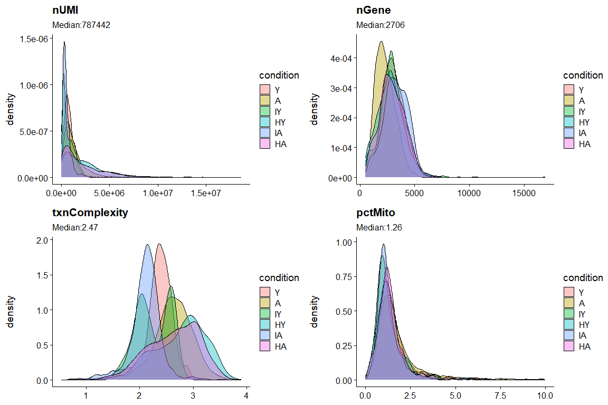
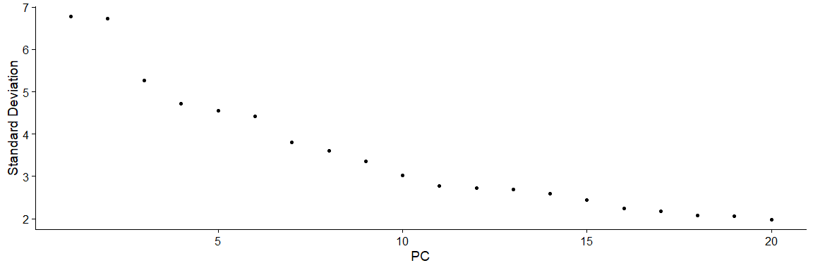
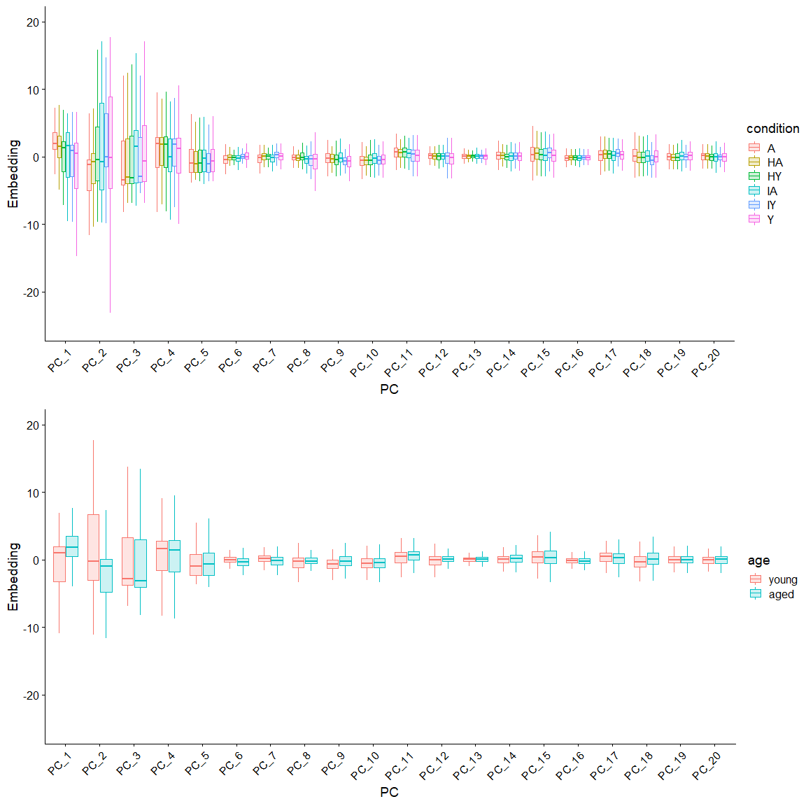
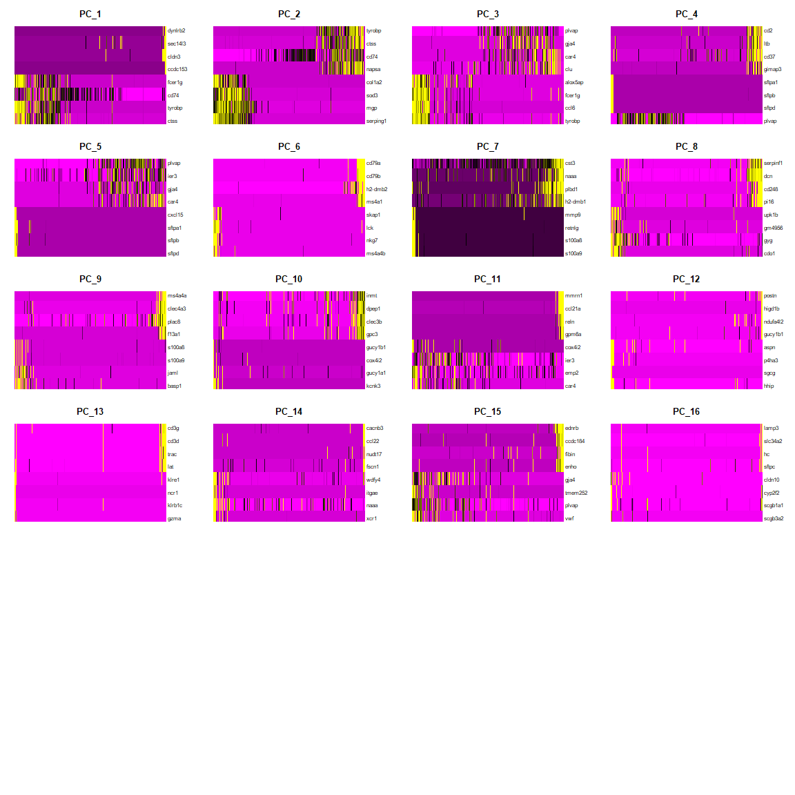
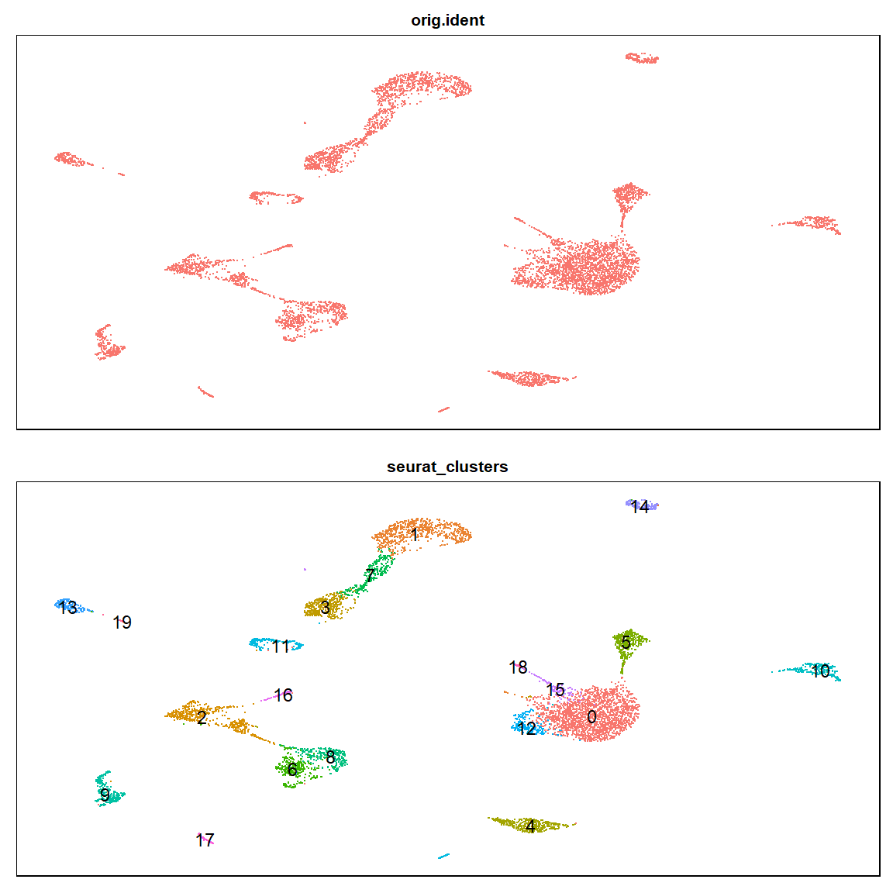
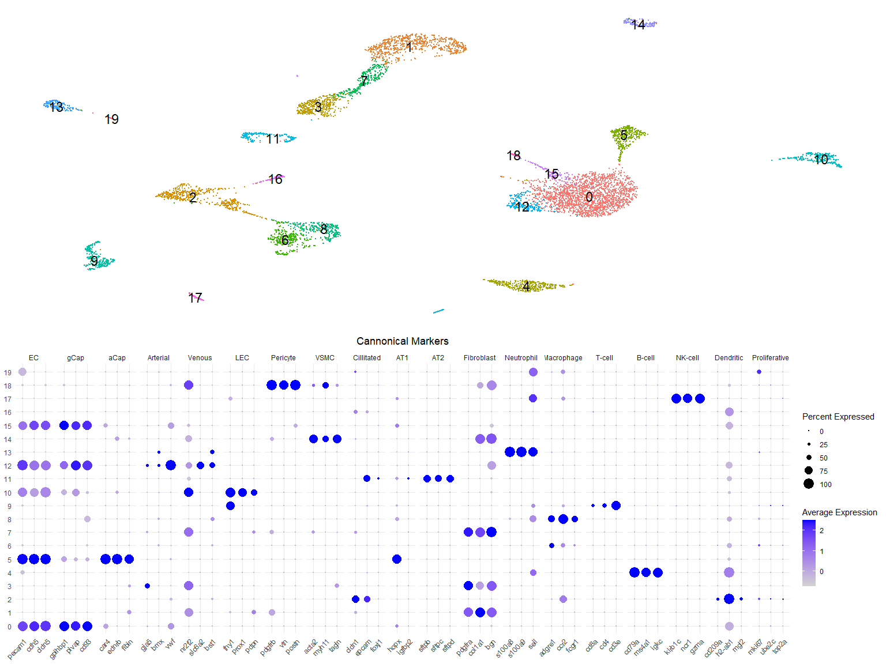
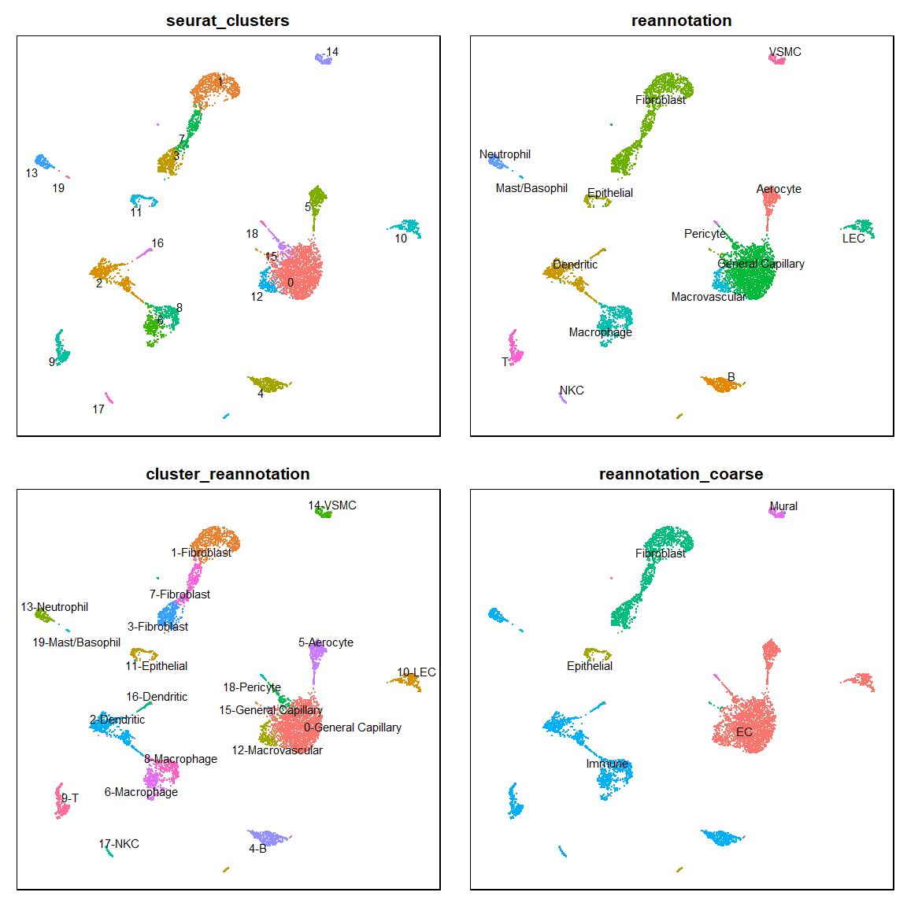
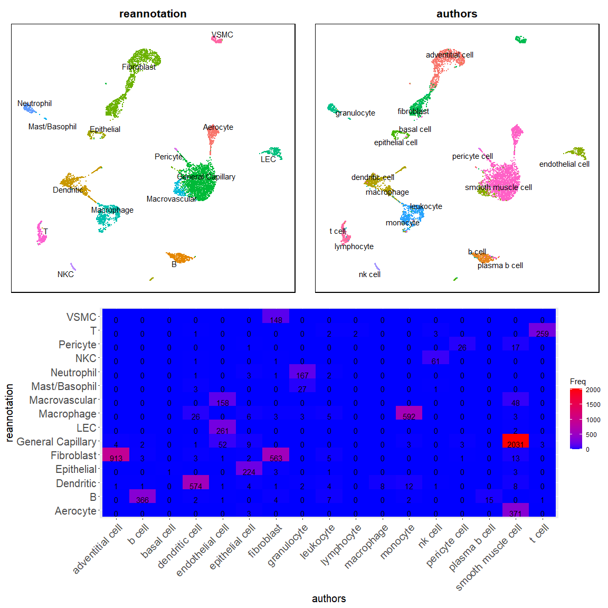
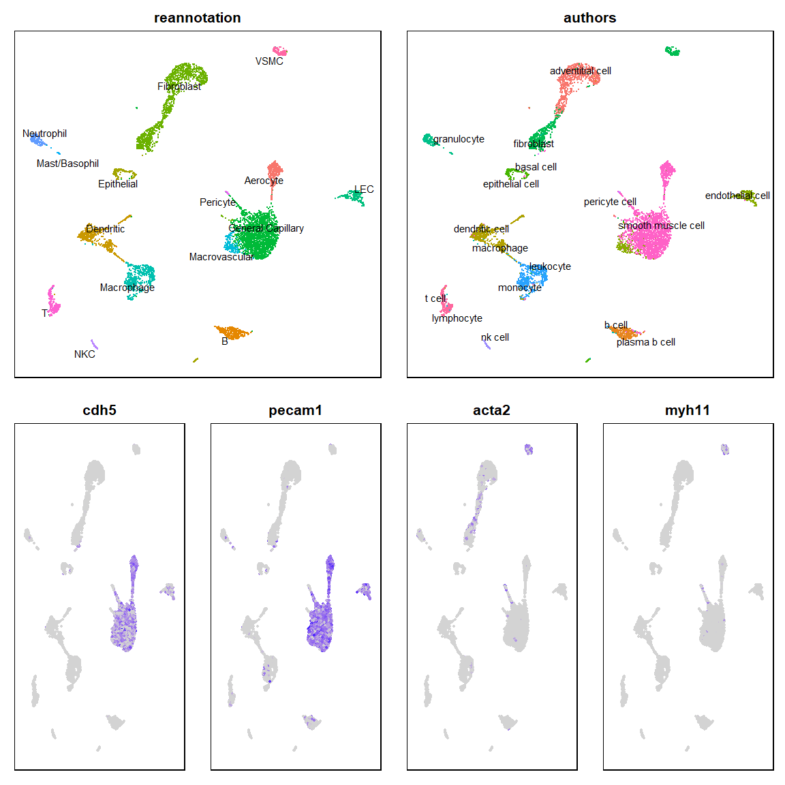
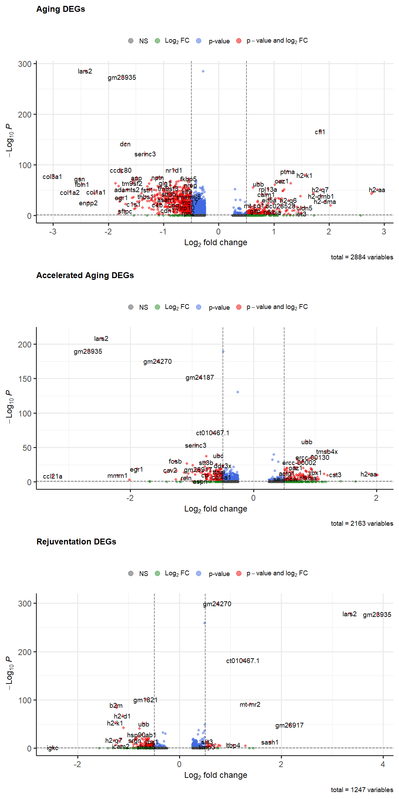

# The Aging Lung

The global population is rapidly aging. Due to global increases in life
expectancy, the [US Census
Bureau](https://www.census.gov/content/dam/Census/library/publications/2016/demo/p95-16-1.pdf)
suggests that individuals age 65 and older will comprise almost 20% of
the world’s population by the year 2050. This demographic shift presents
considerable public health challenges, as aging is a major risk factor
for various chronic and acute inflammatory diseases. Developing
therapies to slow, prevent, or reverse the effects of biological aging
is a major objective for the bio-medical community. However, the
complexity of biological aging across the mosaic of human tissues
remains a roadblock to future discovery.

The lung plays a central role in biological aging. Lung alveoli possess
extremely fine cellular architecture and complex cell signaling networks
to enable pulmonary function. The lung represents a major interface
between our body and environment and must respond appropriately to the
constant barrage of chemical and immunological challenges. Age-associate
disregulation of the lung environment impairs the its ability to
overcome these challenges. The specific mechanisms of this disregulation
are yet to be fully elucidated.

Single-cell RNA sequencing (scRNAseq) represents an important avenue for
the investigation of these mechanisms. By interrogating tissue- and
cell-specific changes during aging, we may help guide efforts to create
new and effective therapeutics. Here I download and re-analyze the lung
scRNAseq data from a [recent
publication](https://pubmed.ncbi.nlm.nih.gov/35236985/) in *Nature*
which uses mouse models of aging and heterochronic parabiosis.

The authors integrate [*Tabula Muris
Senis*](https://www.nature.com/articles/s41586-020-2496-1), a
single-cell atlas of aging mouse organs, with new data from their mouse
model of aging and rejuvenation (reverse aging). Heterochronic
parabiosis is a method of physically connecting the circulatory system
of two mice of different ages. This model induces an accelerated aging
phenotype in the young parabiont and a reversal of aging phenotype in
the old. The authors sequence various tissues from iso- and
hetero-chronic parabionts to address the effect of blood-borne factors
on aging and rejuvenation.

Here I download and re-process the Lung data from this publication.

# Importing required packages for analysis

    library(Seurat)
    library(ggplot2)
    library(tidyverse)
    library(cowplot)
    library(scales)
    library(gtools)
    library(EnhancedVolcano)
    library(openxlsx)

# Importing Dataset

    PALOVICS_SOURCE = "https://figshare.com/ndownloader/files/31635980"
    PALOVICS_DESTINATION = "./Palovics-count-data-lung-annotated.rds"

    # Only download if not present already
    if(!file.exists(PALOVICS_DESTINATION)){
      download.file(url = PALOVICS_SOURCE, destfile = PALOVICS_DESTINATION)
    }
    palovics = readRDS(file = PALOVICS_DESTINATION)

# Quality Control

First, we should examine the quality of the sequenced cells. Common
metrics to analyze include measures of RNA content and the ratio of
mitochondrial transcripts. Here we are generating and formatting for
each cell:

<table>
<tbody>
<tr class="odd">
<td>pctMito</td>
<td>% of counts from mitochondrial-derived genes</td>
</tr>
<tr class="even">
<td>nUMI</td>
<td>number of total counts</td>
</tr>
<tr class="odd">
<td>nGene</td>
<td>number of detected genes</td>
</tr>
<tr class="even">
<td>txnComplexity</td>
<td>log-transformed ratio of nUMI:nGene</td>
</tr>
</tbody>
</table>

    palovics = PercentageFeatureSet(palovics, pattern = "^mt", col.name = "pctMito")
    palovics@meta.data = palovics@meta.data %>%
      rename(nUMI = nCount_RNA,
             nGene = nFeature_RNA) %>%
      mutate(txnComplexity = log10(nUMI/nGene))
    palovics@meta.data[["condition"]] = factor(palovics@meta.data[["condition"]], levels = c("Y", "A", "IY", "HY", "IA", "HA"))

Let’s visualize these QC metric distributions.

    metrics_to_plot = c("nUMI", "nGene", "txnComplexity", "pctMito")

    plot_grid(
      plotlist = metrics_to_plot %>% map(plot_metric),
      align = "hv")+
      ggtitle("Palovics/TMS - QC Metrics")

Here we can see that there is some heterogeneity of these metrics across
the experimental conditions. Many factors can contribute to this
including sequencing depth, cell-type composition, and digestion
procedure. Well thought-out experimental design can attenuate batch
effects, but some variability is always to be expected. In this case,
low quality cells have already largely been filtered and the dataset is
ready for downstream analyses.

# Processing (Part 1)

Next we want to prepare our dataset for further analysis.

1.  Normalize: accounts for cell-to-cell differences in total counts
2.  Reduce Dimension: pare down the gene space to the most important
    features
3.  Principle Component Analysis (PCA): identify complex differences
    between cells

<!-- -->

    palovics = palovics %>%
      NormalizeData() %>%
      FindVariableFeatures() %>%
      ScaleData()%>%
      RunPCA()

## Exploring PCs

To determine which and how many principle components (PCs) to use for
UMAP and clustering, we need to explore a few aspects of the of top PCs.

First, we can look at an elbow plot:

    ElbowPlot(palovics)

This plot shows the variation in each PC. A general rule of thumb is to
stop including PCs after the “elbow”, i.e. when the plot plateaus. This
is qualitative and subjective, but gives a rough starting point.

A more rigorous method is known as a Jackstraw test, which randomly
permutes the dataset and recalculates PCs, ultimately testing the
robustness of each PC. I have forgone this analysis here, but it is good
practice for PC selection.

One phenomenon that occurs with some regularity is the correspondence of
a PC with an experimental condition. Deciding whether to include such a
PC in downstream analyses depends on your goals. Nevertheless, it is
important to identify this correspondence if it exists. A simple way to
test is to plot select PCs pairwise and ID any trends in condition.

    embeddings = palovics@reductions$pca@cell.embeddings[,1:20] %>%
      as.data.frame() %>%
      rownames_to_column(var = "cell") %>%
      gather(key = PC, value = Embedding, PC_1:PC_20) %>%
      mutate(PC = fct_relevel(PC, paste0("PC_", 1:20)))

    embeddings[["condition"]] = map_chr(
      .x = embeddings$cell,
      .f = ~as.vector(palovics@meta.data$condition)[rownames(palovics@meta.data) == .x])

    embeddings[["age"]] = c(A="aged", HA="aged", IA="aged", Y="young",HY="young",IY="young")[embeddings$condition] %>%
      factor(levels = c("young", "aged"))

    plot_grid(
      plotlist = map(
        .x = c("condition", "age"),
        .f = ~ggplot(embeddings, aes_string(x = 'PC', y = 'Embedding', color = .x, fill = .x))+
          geom_boxplot(outlier.shape = NA, alpha = .2)+
          ylim(-25, 20)+
          theme_cowplot()+
          RotatedAxis()),
      ncol = 1)

While some PCs trend slightly with condition, it is likely too minor to
obscure downstream identification of cell populations of interest.

Lastly lets visualize the PC loadings. Loadings are essentially the
weight of each gene, so inspecting the top loadings for the first few
PCs can help us see what expression signatures drive them.

    DimHeatmap(palovics, nfeatures = 8, dims = 1:16, fast = T, ncol = 4)

If the top loadings for a PC describe an axis we you want to drive
downsteam visualization / clustering, it may prove useful to exclude it.
For example, we might exclude a PC if its top loadings were all cell
cycle genes.

# Processing (Part 2)

Now that we have a good view of our PCs, we can choose which to use for
UMAP and clustering. Given the plot above, I think a reasonable starting
set would be PCs 1 through 15.

    palovics = palovics %>%
      RunUMAP(dims = 1:15) %>%
      FindNeighbors(dims = 1:15) %>%
      FindClusters(res=0.6)

    FALSE Modularity Optimizer version 1.3.0 by Ludo Waltman and Nees Jan van Eck
    FALSE 
    FALSE Number of nodes: 7067
    FALSE Number of edges: 241476
    FALSE 
    FALSE Running Louvain algorithm...
    FALSE Maximum modularity in 10 random starts: 0.9213
    FALSE Number of communities: 20
    FALSE Elapsed time: 0 seconds

First we run Uniform Manifold Approximation and Projection (UMAP) which
enables us to visualize high-dimensional trends in gene expression in a
two dimensional plot. Then we generated clusters using a shared nearest
neighbor graph to group similar cells. This gives us a roadmap of the
dataset and identifies potential cell populations.

    plot_grid(
      DimPlot(palovics, label = F, label.size = 6, group.by = "orig.ident")+umap_theme,
      DimPlot(palovics, label = T, label.size = 6, group.by = "seurat_clusters")+umap_theme,
      ncol = 1
    )

Any individual cell alone provides very little information. However, we
can use the average expression across a cluster of cells to vastly
improve the depth and confidence of our analyses. The next step is to
annotate these numbered clusters using cannonical cell-type markers.

# Cluster Annotation

To annotate our cell clusters, we use a set of established cell-type
markers derived from previous from published research. Databases of
transcriptional cell-type markers exist, however, not all database
markers are equally robust or accurate. Here I use a set I compiled from
some previous work with lung scRNAseq. It is not exhaustive but should
provide ample information to make some useful annotations.

    celltype_markers = list(
      `EC` = c("pecam1", "cdh5", "cldn5"),
      `gCap` = c("gpihbp1", "plvap", "cd93"),
      `aCap` = c("car4", "ednrb", "fibin"),
      `Arterial`= c("gja5", "bmx", "vwf"),
      `Venous` = c("nr2f2", "slc6a2", "bst1"),
      `LEC` = c("thy1", "prox1", "pdpn"),
      `Pericyte` = c("pdgfrb", "vtn", "postn"),
      `VSMC` = c("acta2", "myh11", "tagln"),
      `Cillitated` = c("cldn1", "epcam", "foxj1"),
      `AT1` = c("hopx", "igfbp2"),
      `AT2` = c("sftpb", "sftpc", "sftpd"),
      `Fibroblast` = c("pdgfra", "col1a1", "bgn"),
      `Neutrophil` = c("s100a8", "s100a9", "sell"),
      `Macrophage` = c("adgre1", "ccr2", "fcgr1"),
      `T-cell` = c("cd8a", "cd4", "cd3e"),
      `B-cell` = c("cd79a", "ms4a1", "igkc"),
      `NK-cell` = c("klrb1c","ncr1","gzma"),
      `Dendritic` = c("cd209a", "h2-ab1", "mgl2"),
      `Proliferative` = c("mki67", "ube2c", "top2a")
    )

    plot_grid(
      DimPlot(palovics, label = T, label.size = 6, group.by = "seurat_clusters")+
        theme(legend.position = "none")+theme_nothing()+theme(legend.position = "none"),
      DotPlot(palovics, features = celltype_markers, group.by = "seurat_clusters")+
        theme_minimal()+
        RotatedAxis()+
        labs(title = "Cannonical Markers")+
        theme(axis.title = element_blank(), plot.title = element_text(hjust = 0.5)),
    ncol=1
    )

Using the DotPlot as a guide, we can start to assign clusters with their
most likely cellular identity. Here I am making a few different
annotations that might come in handy downstream.

<table>
<thead>
<tr class="header">
<th style="text-align: center;">Cluster Number</th>
<th style="text-align: center;">Cell-type</th>
<th style="text-align: center;">Coarse</th>
</tr>
</thead>
<tbody>
<tr class="odd">
<td style="text-align: center;">0</td>
<td style="text-align: center;">General Capillary</td>
<td style="text-align: center;">EC</td>
</tr>
<tr class="even">
<td style="text-align: center;">1</td>
<td style="text-align: center;">Fibroblast</td>
<td style="text-align: center;">Fibroblast</td>
</tr>
<tr class="odd">
<td style="text-align: center;">2</td>
<td style="text-align: center;">Dendritic</td>
<td style="text-align: center;">Immune</td>
</tr>
<tr class="even">
<td style="text-align: center;">3</td>
<td style="text-align: center;">Fibroblast</td>
<td style="text-align: center;">Fibroblast</td>
</tr>
<tr class="odd">
<td style="text-align: center;">4</td>
<td style="text-align: center;">B</td>
<td style="text-align: center;">Immune</td>
</tr>
<tr class="even">
<td style="text-align: center;">5</td>
<td style="text-align: center;">Aerocyte</td>
<td style="text-align: center;">EC</td>
</tr>
<tr class="odd">
<td style="text-align: center;">6</td>
<td style="text-align: center;">Macrophage</td>
<td style="text-align: center;">Immune</td>
</tr>
<tr class="even">
<td style="text-align: center;">7</td>
<td style="text-align: center;">Fibroblast</td>
<td style="text-align: center;">Fibroblast</td>
</tr>
<tr class="odd">
<td style="text-align: center;">8</td>
<td style="text-align: center;">Macrophage</td>
<td style="text-align: center;">Immune</td>
</tr>
<tr class="even">
<td style="text-align: center;">9</td>
<td style="text-align: center;">T</td>
<td style="text-align: center;">Immune</td>
</tr>
<tr class="odd">
<td style="text-align: center;">10</td>
<td style="text-align: center;">LEC</td>
<td style="text-align: center;">EC</td>
</tr>
<tr class="even">
<td style="text-align: center;">11</td>
<td style="text-align: center;">Epithelial</td>
<td style="text-align: center;">Epithelial</td>
</tr>
<tr class="odd">
<td style="text-align: center;">12</td>
<td style="text-align: center;">Macrovascular</td>
<td style="text-align: center;">EC</td>
</tr>
<tr class="even">
<td style="text-align: center;">13</td>
<td style="text-align: center;">Neutrophil</td>
<td style="text-align: center;">Immune</td>
</tr>
<tr class="odd">
<td style="text-align: center;">14</td>
<td style="text-align: center;">VSMC</td>
<td style="text-align: center;">Mural</td>
</tr>
<tr class="even">
<td style="text-align: center;">15</td>
<td style="text-align: center;">General Capillary</td>
<td style="text-align: center;">EC</td>
</tr>
<tr class="odd">
<td style="text-align: center;">16</td>
<td style="text-align: center;">Dendritic</td>
<td style="text-align: center;">Immune</td>
</tr>
<tr class="even">
<td style="text-align: center;">17</td>
<td style="text-align: center;">NKC</td>
<td style="text-align: center;">Immune</td>
</tr>
<tr class="odd">
<td style="text-align: center;">18</td>
<td style="text-align: center;">Pericyte</td>
<td style="text-align: center;">Mural</td>
</tr>
<tr class="even">
<td style="text-align: center;">19</td>
<td style="text-align: center;">Mast/Basophil</td>
<td style="text-align: center;">Immune</td>
</tr>
</tbody>
</table>

Now we can visualize the UMAP with our newly assigned annotations
instead of the cluster number:

    plot_grid(
      plotlist = map(
        .x = c("seurat_clusters", "reannotation", "cluster_reannotation", "reannotation_coarse"),
        .f = ~ DimPlot(palovics, group.by = .x, label = T, repel = T) + umap_theme)
    )

We can also compare our annotations with those of the original authors.

    palovics@meta.data = palovics@meta.data %>% rename(authors = cell_type)
    confusion = palovics@meta.data %>%
      select(authors, reannotation) %>% 
      table() %>%
      as.data.frame()

    comparison_umap = plot_grid(
      plotlist = map(
          .x = c("reannotation", "authors"),
          .f = ~ DimPlot(palovics, group.by = .x, label = T, repel = T) + umap_theme)
        )

    plot_grid(
      comparison_umap,
      ggplot(confusion,
             aes(x = authors,
                 y = reannotation)) +
        geom_tile(aes(fill = Freq)) +
        geom_text(aes(label = round(Freq, 3)), vjust = 1)+
        scale_fill_continuous(low = "blue", high = "red")+
        theme(axis.text = element_text(size=15), axis.title = element_text(size = 15))+
        RotatedAxis(),
      ncol = 1
    )

Here we see that there is considerable dissonance between our cell
annotations. Some of these differences are semantic, ex. “Fibroblasts”
and “Adventitial”. However, some differences are completely at odds. The
largest discrepancy is between my endothelial cell (EC) clusters and the
authors’ “smooth muscle cell” annotation.

    plot_grid(
      comparison_umap,
      plot_grid(
        plotlist = map(
          .x = c("cdh5", "pecam1", "acta2", "myh11"),
          .f = ~ FeaturePlot(palovics, features = .x, pt.size = 1)+umap_theme
          ), nrow = 1),
      ncol = 1
    )

Given the high expression of cannonical EC markers, I believe the
authors’ annotation to be mis-attributed. This lung dataset is only a
small fraction of a much larger scRNAseq organ survey and mis-annotation
is not uncommon in datasets of that scale. Disparate tissues are often
integrated together and sometimes organ-specific identities get
distorted. Our work here shows the value of doing your own analysis of
cell identity.

# Differential Expression

Now that we have a processed and accurately annotated scRNAseq dataset,
we can start to investigate the effects of our models. First we need to
understand the experimental conditions, summarized below:

<table>
<thead>
<tr class="header">
<th style="text-align: center;"><strong>Abbreviation</strong></th>
<th style="text-align: center;"><strong>Condition</strong></th>
</tr>
</thead>
<tbody>
<tr class="odd">
<td style="text-align: center;">Y</td>
<td style="text-align: center;">Young</td>
</tr>
<tr class="even">
<td style="text-align: center;">A</td>
<td style="text-align: center;">Aged</td>
</tr>
<tr class="odd">
<td style="text-align: center;">IY</td>
<td style="text-align: center;">Iso-chronic Young</td>
</tr>
<tr class="even">
<td style="text-align: center;">HY</td>
<td style="text-align: center;">Hetero-chronic Young</td>
</tr>
<tr class="odd">
<td style="text-align: center;">IA</td>
<td style="text-align: center;">Iso-chronic Aged</td>
</tr>
<tr class="even">
<td style="text-align: center;">HA</td>
<td style="text-align: center;">Hetero-chronic Aged</td>
</tr>
</tbody>
</table>

The three main comparisons we are interested in are:

<table>
<thead>
<tr class="header">
<th style="text-align: center;"><strong>Comparison</strong></th>
<th style="text-align: center;"><strong>Reference</strong></th>
<th style="text-align: center;"><strong>Experimental</strong></th>
</tr>
</thead>
<tbody>
<tr class="odd">
<td style="text-align: center;">Aging</td>
<td style="text-align: center;">Y</td>
<td style="text-align: center;">A</td>
</tr>
<tr class="even">
<td style="text-align: center;">Accelerated Aging</td>
<td style="text-align: center;">IY</td>
<td style="text-align: center;">HY</td>
</tr>
<tr class="odd">
<td style="text-align: center;">Rejuvenation</td>
<td style="text-align: center;">IA</td>
<td style="text-align: center;">HA</td>
</tr>
</tbody>
</table>

We could probe the dataset as a whole for differentially expressed genes
(DEGs) to find global trends, however typically we are interested in a
more specific cell population. Here I will perform differential
expression analysis for vascular endothelial cells across all three key
comparisons.

    palovics_ec = subset(palovics, reannotation %in% c("General Capillary", "Aerocyte", "Macrovascular"))
    degs = list(
      `Aging` = FindMarkers(palovics, group.by = "condition",
                            ident.1 = "A", ident.2 = "Y") %>%
                rownames_to_column(var = "gene"),
      `Accelerated Aging` = FindMarkers(palovics, group.by = "condition",
                                        ident.1 = "HY", ident.2 = "IY") %>%
                rownames_to_column(var = "gene"),
      `Rejuventation` = FindMarkers(palovics, group.by = "condition",
                                    ident.1 = "HA", ident.2 = "A") %>%
                rownames_to_column(var = "gene")
    )
    # To save these DEGs as a excel file, run this line:
    # openxlsx::write.xlsx(degs, file = "./EC_Palovics_DEGs.xlsx")

We can visualize these DEGs with volcano plots. The x axis (log2FC)
represents the effect size of the condition on a given gene and the y
axis (-log10(Adjusted P-value)) represents our confidence that this
effect is real.

    plot_grid(
      plotlist = map2(
        .x = degs,
        .y = names(degs), 
        .f = ~EnhancedVolcano(.x, lab = .x$gene,
                         x = "avg_log2FC", y = "p_val_adj",
                         FCcutoff = 0.5, pCutoff = 0.05,
                         xlim = c(min(.x$avg_log2FC), max(.x$avg_log2FC)),
                         title = paste0(.y, " DEGs"), subtitle = "")
        ),
      ncol = 1)

For downstream analyses, it is good practice to filter low confidence
and low effect-size DEGs. The central gap in each volcano plot
demonstrates that some filtering has already taken place. Our DE testing
has a default log2(Fold Change) threshold of 0.25, but further filtering
is recommended.

# Next Steps

With these data in hand, we can now explore various avenues for further
analysis. Some of these include:

-   Compare these data with our own aging lung dataset

    -   Cross-reference DEGs to find corroborating aging markers in ECs

    -   Dataset integration to ensure accurate comparison

-   Geneset Enrichment analysis of DEGs

    -   GSEA, EnrichR (GO/KEGG/etc)

-   Ligand-Receptor analysis to identify altered signaling

# Notes

I have already contacted the authors regarding the celltype annotations
of this dataset. There is no need to contact them further about this
matter, the re-annotation here is purely for improved accuracy for our
own use.
